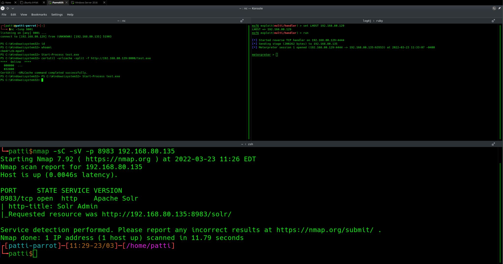

# stealthy-snail


Credit to John Hammond of Huntress.  I followed his Try Hack Me room for log4j and replicated in my own virtual environment.

```https://tryhackme.com/room/solar```

Once you have a shell try and find fun ways to maintain persistince.  I'll be trying to create a Python C2 in this space eventually
